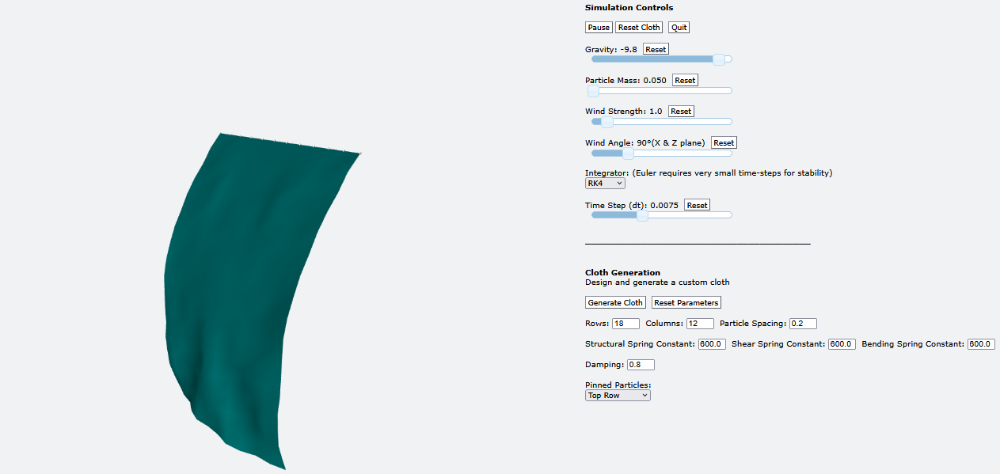

# 3D Mass-Spring Cloth Simulation
**Course**: CSCI 3010U Simulation & Modeling

**Author**: Nathan Tandory

## Overview
A real-time 3D cloth simulation using a mass-spring-damper model. The cloth is modeled as a grid of particles connected by structural, shear, and bend springs. Two numerical solvers, Euler's method and Fourth-order Runge-kutta (RK4) are implemented. Built with Python, VPython, and NumPy.

Detailed analysis, results, and discussion are provided in the course report PDF.

## Requirements
- Python 3.10+
- pip

## Setup

Create a virtual environment:
```bash
python -m venv .venv
```

Activate the virtual environment:
```bash
#
#   Windows:
#
#       for Git Bash:
source .venv/Scripts/activate

#
#   MacOS / Linux:
#
source .venv/bin/activate
```

Install dependencies in the virtual environment:
```bash
pip install setuptools numpy vpython
```

## Running
From the project root, with the virtual environment activated:
```bash
python src/main.py
```

A browser window will open with the 3D visualization and control panel.

## Usage & Controls



### Simulation Controls
- `Pause/Resume`: pause or resume the simulation
- `Reset Cloth`: reset the cloth to its initial state
- `Quit`: quit the simulation
- `Gravity`: adjust gravity in real time
- `Particle Mass`: adjust particle mass in real time
- `Wind Strength`: adjust wind strength in real time
- `Wind Angle`: adjust wind angle in real time (X & Z axes)
- `Time Step`: adjust time step in real time
- `Integrator`: switch between **fourth-order Runge-Kutta** and **Euler** numerical integrators

### Cloth Generation
- `Generate Cloth`: generate a new cloth with the current parameters
- `Reset Parameters`: reset cloth parameters to default values *(defaults defined in config.py)*
- `Rows`: number of rows in the cloth
- `Columns`: number of columns in the cloth
- `Particle Spacing`: space between each particle
- `Spring Constants`: spring constants for structural, shear, and bend springs
- `Damping`: damping constant for all springs
- `Pinned Particles`: selection of pinned particles

## Project Structure
```
src/
├── main.py                     # simulation setup and main loop
├── config.py                   # simulation and cloth configuration
├── models/
│   └── cloth.py                # cloth grid structure, springs, and state
├── rendering/
|   └── renderer.py             # vpython visualization and UI
└── simulation/
    ├── derivatives.py          # vectorized derivative computation
    ├── integrators.py          # euler and rk4 integrators
    └── simulation.py           # simulation functions and cloth management
```